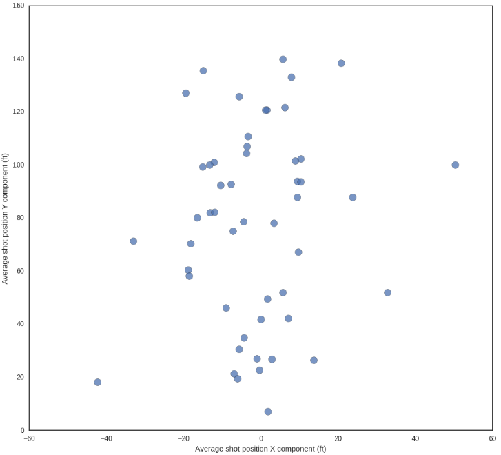
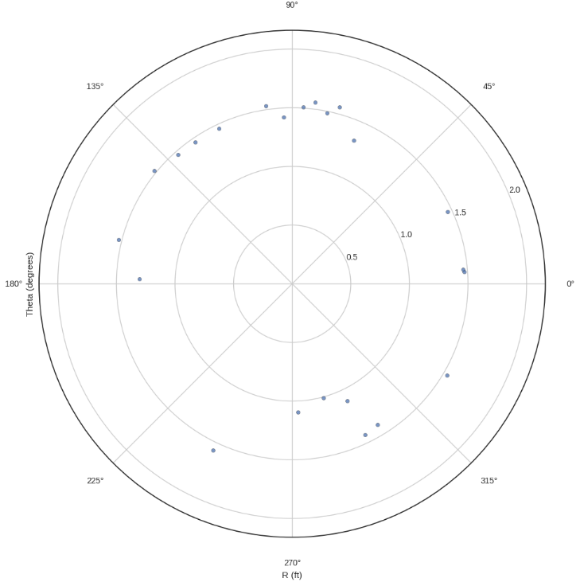
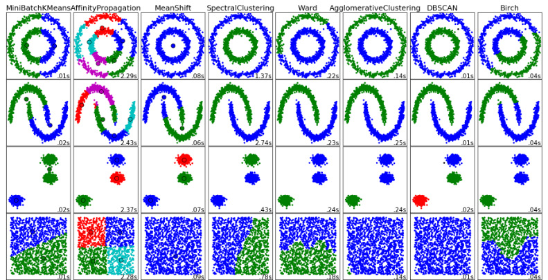
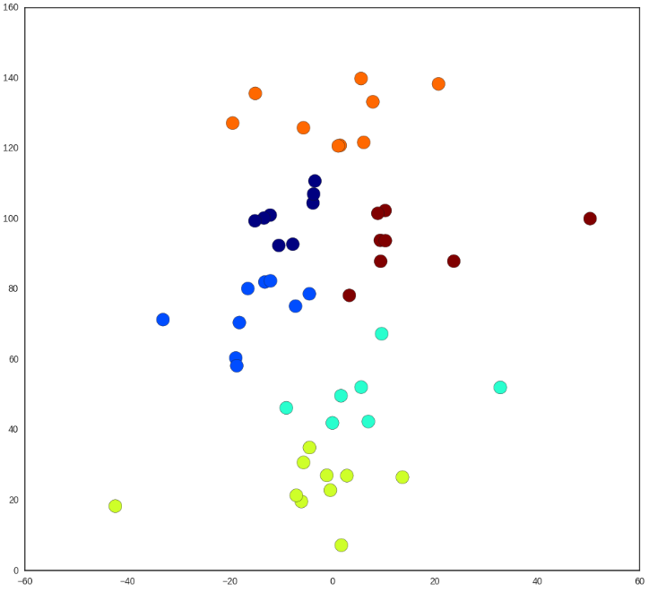
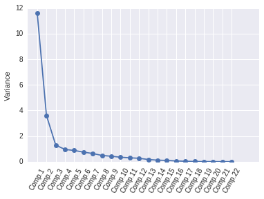
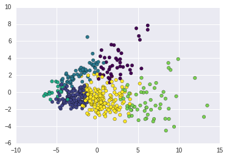

# Finding NBA Players with Similar Styles
## by Willem Thorbecke and David Papp

[Jupyter Notebook](https://github.com/davpapp/ThinkStats2/blob/master/code/report3nba.ipynb)

### Introduction
Like most sports in the US, the NBA is obsessed with numerical data. It closely tracks over thirty statistics for each player. Such a large amount of data has great potential for analysis. Players in the NBA are often compared to others, both active and retired, based on similar play styles. For example, it is common to hear statements such as “Russell Westbrook is the new Derrick Rose”. The purpose of our project is to apply machine learning in the form of clustering to see which players are actually similar based on 22 variables. 

We successfully generated clusters of players that are very similar quantitatively. It is up to the reader to decide whether this is qualitatively true.

### NBA Data
We used a third-party API to download official data from the NBA. The API fetched relevant information from the NBA's website, including players’ shot distributions, positions, field goal averages, and more. 

### Analysis
Our goal was to create a cluster model from which we can group play styles. In our first model, we aimed for simplicity and thus narrowed our parameters to just shot positioning. Since shot positioning is likely good indicator of a player’s position, we were curious to see if we could accurately cluster and predict a player’s position based on his the locations of his shots.

In order to allow us to use Sklearn cluster models, we had to represent each player as a singular point. To do this, we found each player’s average shot location on the court. It’s worth noting that a more advanced approach would have been to take a different machine learning approach where each player was represented as a distribution.

The Cartesian and polar plots are shown below. The Cartesian one is easier to interpret.

We studied Sklearn’s available clustering algorithms and chose Affinity Propagation based on our expected results. This type of clustering is the most sensitive to “exemplars”, which are members of the input set that are representative of clusters [Affinity Propagation](https://en.wikipedia.org/wiki/Affinity_propagation). This model seemed to be well aligned with basketball positions and did not require us to specify the number of clusters.

When fitted to players’ average shot positions, the following results were obtained:

A few things stand out from this. Affinity Propagation clustering produced 5 distinct clusters (despite not requiring the number of clusters as an input parameter). This supports the validity of the clustering model since there are 5 positions in basketball. Furthermore, the clusters are more or less aligned with the typical positions.

Using this model, we can now obtain a prediction for a player’s position. For example, to predict Dwight Howard’s position, we can add him to the cluster model. With an average shot position of (-0.63, 16.49), our model predicts him to be a center, which is accurate. 

Next, we attempted to cluster players based on a dozen or so basic NBA stats such as field goal percentage, minutes played per game and rebounds per game. The purpose of this was to identify which players had similar playing styles. This process was completed by way of multivariate analysis followed by a k-means clustering model. The process of multivariate analysis involved loading the list of stats for each player in the NBA and then normalizing them so that we could find the principal components of the dataset. Graphing the variance of the components reveals that a decent degree of accuracy can be maintained when using only the first few principal components. This greatly reduces the computational complexity of the clustering algorithm.

For the sake of simplicity, we decided to plot and cluster a graph of the first two components using a k-means algorithm.

In order to qualitatively assess the validity of this model, we selected players from each of these clusters who on average played more than 25 mins per game this season.

Interestingly, filtering like this eradicated two entire cluster. This left us with three clusters major clusters to parse through, due to the nature of the clustering seen above, our model lends itself to including outliers in each of the clusters. 

Despite the large spread in our clusters, our model was able to identify a cluster of power forwards/centers with 75 percent accuracy (Cluster 1). The first 3/4s of our three clusters are shown below as examples, with outliers shown in bold (refer to our Jupyter Notebook for the complete list of clusters):

Current categories for NBA positions include: 
- PG = point guard
- SG = shooting guard
- SF = small forward
- PF = power forward
- C = center 

Generally speaking, a point guard is the smallest player on the floor and a center is the largest, and all the players in between have on average, heights in ascending order (based on the listing above). With that being said, the skill sets of the various positions often overlaps with the position above or below it on the list above. As is the case with most data and categories, there are outliers such as centers who have similar playing styles to guards.

The three clusters of NBA players playing more than 25 minutes are listed below. Qualitatively and quantitatively one can access that the playing style of most of the players listed below is very similar. This can be roughly verified by looking at the similarity in positions with outliers being listed in bold. 

Cluster 1:
- Steven Adams (Center/PF)
- LaMarcus Aldridge (Center/PF) 
- Willie Cauley-Stein (Center/PF)
- Boris Diaw (Center/PF)
- __Goran Dragic (PG)__
- Marcus Georges-Hunt (SG/SF)
- Taj Gibson (Center/PF)
- Aaron Gordon (Center/PF)
- Draymond Green (Center/PF)
- __Tim Hardaway Jr. (Guard)__
- Al Horford (Center/PF)
- __Tyler Johnson (Guard)__
- __Tyus Jones (Point Guard)__
- Enes Kanter (Center/PF)
- Kevon Looney (Center/PF)
- Nikola Pekovic (Center/PF)
 
Cluster 2:
- Arron Afflalo (SG)
- Tony Allen (SG)
- Al-Farouq Aminu (SG/SF)
- Ryan Anderson (SF)
- Trevor Ariza (SG/SF)
- Kent Bazemore (SG)
- Patrick Beverley (PG/SG)
- Bojan Bogdanovic (SF)
- __Chris Bosh (PF)__
- Corey Brewer (SG)
- Jose Calderon (PG)
- __Clint Capela (PF)__
- __Tyson Chandler (Center)__
- Ian Clark (PG/SG)
- Norris Cole (PG/SG)
- __DeMarcus Cousins (Center)__
- __Robert Covington (Forward)__
- Allen Crabbe (SG)
- Jordan Crawford (SG, PG)
- __Dante Cunningham (Forward)__
- Malcolm Delaney (SG)
- Matthew Dellavedova (PG)

Cluster 3:
- Giannis Antetokounmpo (PG)
- Carmelo Anthony (SF)
- Harrison Barnes (SF)
- Will Barton (SG)
- Nicolas Batum (SF)
- Bradley Beal (SG)
- Eric Bledsoe (SG)
- Devin Booker (SG)
- Alec Burks (SG
- __Nick Collison (PF)__
- Quinn Cook (PG)
- Seth Curry (SG)
- Troy Daniels (SG)
- Ed Davis (SF)
- Toney Douglas (PG)
- Kris Dunn (SG)
- Monta Ellis (SG)
- Dorian Finney-Smith (SF)

A quick analysis of these clusters reveals certain trends. The first five names of the third cluster consist of 6'8, versatile scorers with argueably similar styles of play. Cluster 1 is littered with skilled power forwards and centers. The second clusters looks to be the most inconsisent, containing multiple centers and power fowards in a list of shooting guards and point guards. With that being said, players like Chris Bosh (PF) and Demarcus Cousins (C) have playing styles akin to a guard -- both take many 3 point shots and consitantly rack up a decent number of assists.

It is now up to the reader’s discretion to decide whether these players exhibit similar play styles. We certainly think so. Many of the players in each cluster play either the same position or are separated by a single position (e.g., a point guard and a shooting guard are a single position apart), which is strongly indicative of play style.
