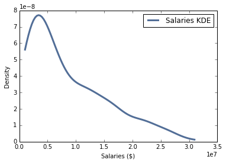
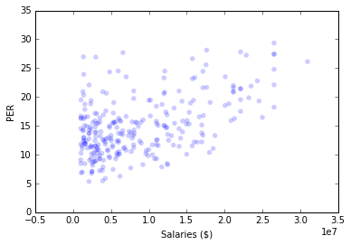

# Higher paid NBA players are (probably) deserving 

NBA players are paid millions of dollars a year to play sports and this doesn't account for shoe deals, TV advertisements, and any other endoresments. I'm not here to make an arguemnt against an NBA player's salary. I do however wonder if there lies a correlation between how much an NBA player is paid and how well he performs on the court. Using data from ESPN and hoopshype.com, I looked into whether there existed some kind of correlation between an NBA player's salary and his quantitative performance.

### Methodology

First I thought about the best way to measure the impact of an NBA player. I came across player effiency rating (PER). PER relies on a detailed formula that takes into account just about every major basketball statisic and spits out a number that attempts to encapsulates a player's overall contributions in a single number. Seeing as PER was calculated in such a way that I could compare starters and bench players, I decided to use it as a variable that I would map to NBA players' salaries.

After deciding on an NBA statistic to use I began scrapping the web for data. I found salaries for the 411 highest paid NBA players on hoopshype.com. And I found PER stats for the top 342 players in the league on ESPN.com. 

Once the data was scrapped from the web and stores in lists in a Jupyter Notebook, I began maping PERs to players. Somewhat surprisingly the out of the 342 players with the highest PERs, only 273 were part of the 411 highest paid NBA players. I looked into this further and found injuries to be the reason for this in a couple of cases. 

### Results

The KDE of salaries is noteable because it is long tailed. There are not a lot of players that get paid in the tens of millions, and this shows in the graph. The probability density of getting paid over 25 million dollars is nearly an order of magnitude less than the probably density of the average NBA salary in this data set (roughly 8 million dollars).

The KDE of PERs is only slightly long tailed in comparision to the KDE of salaries. This may suggest that the increase in salaries across players is inflated in comparision to PERs across players. 

The scatter plot of NBA salaries and PERs shows a slight correlation between the two variables.

### Interpretation

Both the correlation and Spearman Correlation, .5 and .4 respectively, suggest that there is a slight correlation between a player salaries and PERs. This result is by no means conclusive since the PER statistic is not bulletproof. It's hard to compare players who player a couple minutes a game against players who play entire games -- something PER attempts to do here.

### Jupyter Notebook:
https://github.com/willythor/ThinkStats2/blob/master/code/report1.ipynb
