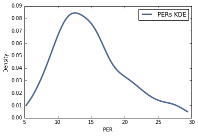

# Higher paid NBA players are (probably) deserving 

NBA players are paid millions of dollars a year to play sports and this doesn't account for shoe deals, TV advertisements, and any other endoresments. I'm not here to make an arguemnt against an NBA player's salary. I do however wonder if there lies a correlation between how much an NBA player is paid and how well he performs on the court. Using data from ESPN and hoopshype.com, I looked into whether there existed some kind of correlation between an NBA player's salary and his quantitative performance.

### Methodology

First I thought about the best way to measure the impact of an NBA player. I came across player effiency rating (PER). PER relies on a detailed formula that takes into account just about every major basketball statisic and spits out a number that attempts to encapsulates a player's overall contributions in a single number. Seeing as PER was calculated in such a way that I could compare starters and bench players, I decided to use it as a variable that I would map to NBA players' salaries.

After deciding on an NBA statistic to use I began scrapping the web for data. I found salaries for the 411 highest paid NBA players on hoopshype.com. And I found PER stats for the top 342 players in the league on ESPN.com. 

Once the data was scrapped from the web and stores in lists in a Jupyter Notebook, I began maping PERs to players. Somewhat surprisingly the out of the 342 players with the highest PERs, only 273 were part of the 411 highest paid NBA players. I looked into this further and found injuries to be the reason for this in a couple of cases. 

### Results

### Interpretation

Both the correlation and Spearman Correlation, .5 and .4 respectively, suggest that there is a notable correlation between a players' salaries and their PERs. 

### Jupyter Notebook:

